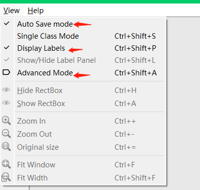

## 1.训练

### 1.1使用预训练模型

使用pre_trained/yolov5s.pt预训练模型，该模型包含80个类别的预测。

定义数据集：mask_detection/wearmask.yaml，数据集使用labelimg(使用pip安装的一个软件，直接在Windows搜索栏搜索)。制作数据集见1.2。

因为使用预训练模型，则参数--cfg='',该参数是指定模型结构的，这里不需要。

```
--weights yolov5s.pt
--data mask_detection/wearmask.yaml
```

有一个疑问，即预训练模型的预测类别有80个，而这里训练集GT类别只有1个，它们怎么搭配的？目前我猜测是并没有使用预训练模型的输出层，只使用了输出层之前的部分，然后根据训练数据集来构造输出层。通过netron查看模型结构可以看到，yolov5s.pt的nc是80，而这里训练得到的口罩识别模型的nc是1。

**运行的结果在runs/train/exp{n}下面**。

### 1.2自定义网络结构

这里检测行人和汽车。

#### 1.2.1标注

先试用labelimg构造数据集，以train数据为例，validation数据相同:

- 打开labelimg,在view中选择下面几项

  

  **Auto Save mode**：当你切换到下一张图片时，就会自动把上一张标注的图片标签自动保存下来，这样就不用每标注一样图片都按Ctrl+S保存一下了

  **Display Labels**：标注好图片之后，会把框和标签都显示出来
  **Advanced Mode**：这样标注的十字架就会一直悬浮在窗口，不用每次标完一个目标，再按一次W快捷键，调出标注的十字架

- Open Dir

  打开要标注的图片所在的文件夹，这里是car_and_person/train/images,之后会跳出弹框要求选择标签要保存在哪个文件夹中，这里选择与images同级的car_and_person/train/labels，因为YOLOv5会自动到与数据集同级的labels目录下去找标签，所以在后面.yaml文件中只用指定数据集位置，不用显式指定labels位置。

- 选择数据集格式为yolo

  

- 点击Next Image开始标注

  每标完一张图片则在labels文件夹下生成对应图片的标注信息

  

  第一个数字是所属类别的index；后四个数字是框的中心点坐标和框的宽高，进行了归一化。归一化参考https://blog.csdn.net/weixin_41010198/article/details/106072347。

  Next Image继续标注下一张。

  注意在labels目录下有个classes.txt文件，这里记录了所有的类别名称，从上到下对应着从0开始的index，类别的顺序实际上是根据标注的时候的先后顺序得来的。

  所以在.yaml中指名类别是顺序要和这里保持一致，不然会出现类别和index对应混乱。

  

- car_and_person.yaml

  定义一个yaml文件，该文件的位置这里就放在car_and_detection下面

  

虽然car_and_person.yaml与train和val同级，但写路径时还是把父目录带上了，这里不探究其原因。

#### 1.2.2 网络结构

这里仍使用yolov5s,复制models下的yolov5s.yaml,改名为yolov5s_2.yaml,修改其中的nc为2,因为这里是训练两类别识别的模型。

#### 1.2.3运行train.py


因为使用自定义结构从0开始训练，所以预训练模型参数--weight不需要，取''；--cfg即模型结构；--data即定义训练与验证数据的yaml文件；--workers置为3，参见https://blog.csdn.net/flamebox/article/details/123011129。

这里使用20张图片300个epoch得到的模型效果较差，仅作为演示。

### 2.验证

使用上面训练过的模型来验证


结果在/runs/val/exp{n}下面

### 3.测试

运行detection.py


source可以是单张图片、包含n张图片的文件夹、视频文件、rtsp地址等等。

data参数是用yaml文件指定的测试集


如果指定了source参数，则data参数不起作用。

结果在runs/detect/exp{n}下面。
